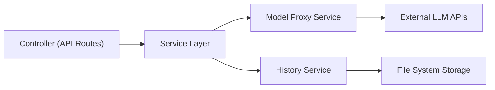

## 1. Architecture Design
```mermaid
graph TB
  subgraph "Frontend (React + TypeScript)"
    A["主页面"]
    B["模型管理组件"]
    C["历史对话组件"]
    D["状态管理 (Zustand)"]
  end

  subgraph "Backend (Express + TypeScript)"
    E["API 路由层"]
    F["模型代理服务"]
    G["对话存储服务"]
  end

  subgraph "External Services"
    H["豆包 API"]
    I["Deepseek API"]
    J["千问 API"]
    K["文心一言 API"]
  end

  A --&gt; D
  B --&gt; D
  C --&gt; D
  D --&gt; E
  E --&gt; F
  E --&gt; G
  F --&gt; H
  F --&gt; I
  F --&gt; J
  F --&gt; K
```

## 2. Technology Description
- Frontend: React@18 + TypeScript + Tailwind CSS + Vite
- Backend: Express@4 + TypeScript
- State Management: Zustand
- HTTP Client: Axios
- Initialization Tool: vite-init (react-express-ts template)

## 3. Route Definitions
| Route | Purpose |
|-------|---------|
| / | 首页 - 主交互界面 |
| /api/chat | 发送提问到多个模型 |
| /api/models | 获取模型列表和状态 |
| /api/history | 历史对话管理 |

## 4. API Definitions
```typescript
// 模型平台类型
type ModelPlatform = 'doubao' | 'deepseek' | 'qianwen' | 'wenxin';

interface ModelStatus {
  platform: ModelPlatform;
  name: string;
  connected: boolean;
  icon?: string;
}

interface ChatRequest {
  prompt: string;
  platforms: ModelPlatform[];
}

interface ChatResponse {
  platform: ModelPlatform;
  success: boolean;
  content?: string;
  error?: string;
  timestamp: number;
}

interface HistoryItem {
  id: string;
  prompt: string;
  responses: ChatResponse[];
  timestamp: number;
}
```

## 5. Server Architecture Diagram


## 6. Data Model
### 6.1 Data Model Definition
使用文件系统存储历史对话记录，不使用数据库。

### 6.2 Data Definition Language
不适用
