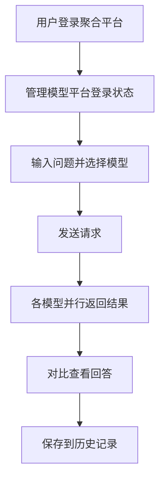

## 1. Product Overview
大模型结果聚合平台 - 一次提问，同时获取多个大模型的回答，方便对比选取最优结果
- 解决用户需要切换多个大模型平台进行提问的痛点，提供统一的输入界面和结果聚合展示
- 目标用户为需要对比多个大模型回答质量的开发者、研究者和内容创作者

## 2. Core Features

### 2.1 User Roles
| Role | Registration Method | Core Permissions |
|------|---------------------|------------------|
| Normal User | Email/Social login | 使用所有核心功能，管理模型平台登录状态，保存历史对话 |

### 2.2 Feature Module
1. **首页/主界面**：统一输入框、模型选择器、多模型结果展示区域
2. **模型平台管理**：豆包、Deepseek、千问、文心一言登录状态管理
3. **历史对话**：查看和管理历史提问记录

### 2.3 Page Details
| Page Name | Module Name | Feature description |
|-----------|-------------|---------------------|
| 首页 | 统一输入框 | 支持多行输入，一键发送到选中的多个模型 |
| 首页 | 模型选择器 | 可视化选择要同时提问的模型平台 |
| 首页 | 结果展示区 | 分栏展示各模型的实时返回结果，支持滚动同步 |
| 模型管理 | 登录状态管理 | 各平台独立登录入口，显示当前连接状态 |
| 历史对话 | 对话列表 | 时间轴展示历史提问，支持快速重问 |

## 3. Core Process
用户登录聚合平台 → 管理各模型平台的登录状态 → 在统一输入框输入问题 → 选择要提问的模型 → 点击发送 → 各模型并行返回结果 → 用户查看对比结果 → 可保存到历史记录

## 4. User Interface Design
### 4.1 Design Style
- **主要配色**：深蓝色系为主色调（科技感），辅以青色和橙色作为强调色
- **按钮风格**：圆角矩形，轻微阴影，hover时有放大效果
- **字体**：使用现代无衬线字体，标题加粗，正文清晰易读
- **布局风格**：卡片式布局，清晰的区域分隔，充足的留白
- **图标风格**：线性图标，保持简约一致的视觉语言

### 4.2 Page Design Overview
| Page Name | Module Name | UI Elements |
|-----------|-------------|-------------|
| 首页 | Hero区域 | 渐变背景，引人注目的标题，简洁的功能说明 |
| 首页 | 输入区域 | 大面积输入框，模型选择按钮阵列，发送按钮 |
| 首页 | 结果展示区 | 响应式卡片网格，每个模型结果独立卡片，加载动画 |
| 模型管理 | 登录面板 | 各平台品牌色标识，登录状态指示器，操作按钮 |
| 历史对话 | 列表 | 时间轴样式，卡片式历史项，快速操作按钮 |

### 4.3 Responsiveness
- Desktop-first 设计，优先保证大屏体验
- 自适应布局，在平板和手机上也能良好展示
- 触摸优化，移动端交互友好

### 4.4 3D Scene Guidance
不使用 3D 场景
